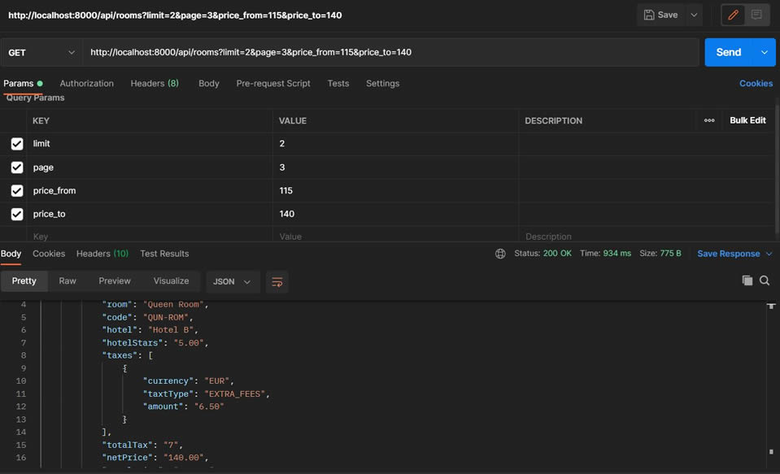

# Simple advert poll from sample advertisers
# Setup Database
Open up the .env file, replace the values shown below with your database configuration.
```bash
DB_HOST=your database host
DB_DATABASE=your database name
DB_USERNAME=your database username
DB_PASSWORD=your database user password

```

# Basic setup
Install dependencies
```bash
 Composer install
```
# Run Migrations
```bash
 php artisan migrate
```
# Seed Data
```bash
 php artisan adverts:poll
```
# Generate Encryption key
```bash
 php artisan key:gen
```
# Start Application

```bash
 php artisan serve
```
# Run unit test
```bash
 ./vendor/bin/phpunit
```

# Run on Docker
Navigate to the directory on your terminal and run the command below

```bash
 docker-compose up -d or docker compose up -d
``` 
# URL
Local base url - http://localhost:8000
Docker base url - http://localhost:8080

# Endpoint
http://localhost:8000/api/rooms
# Filter Params
1. page - for pagination
2. limit - limit results default is 20
3. price_from - set minimum price to filter
4. price_to - set maximum price to filter

</a></p>
# Author
Anyaso Franklin <br />
franko172000@gmail.com


